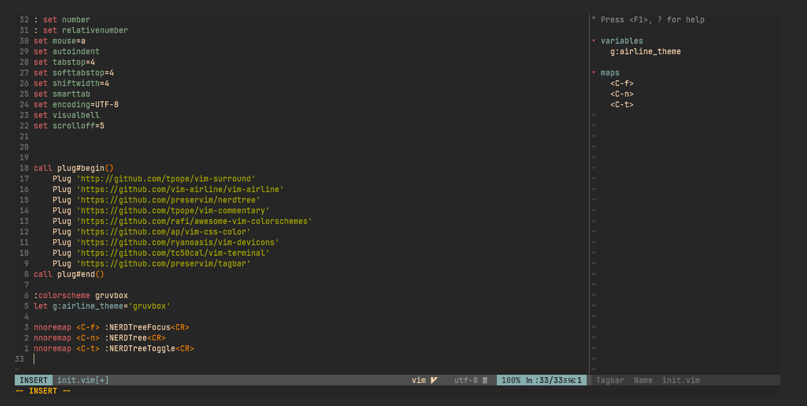

# 🌀 My Neovim Config

Custom Neovim setup built from scratch on Linux 🐧 — optimized for performance, aesthetics, and workflow productivity.

## ✨ Features
- vim-based configuration
- Mason + LSP setup for multiple languages
- Treesitter syntax highlighting
- Telescope fuzzy finder
- Lazy.nvim plugin manager

## 📦 Setup
Clone it to your config folder:
```bash
git clone https://github.com/SENURA-404/neovim-config ~/.config/nvim



